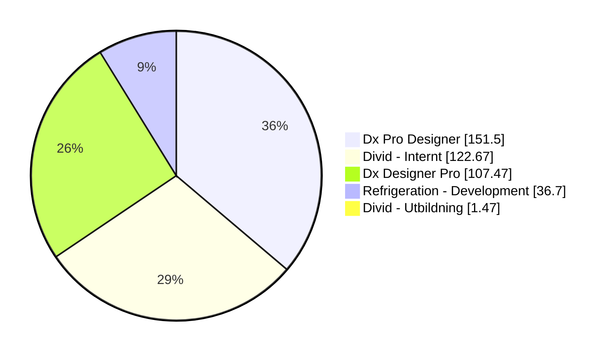
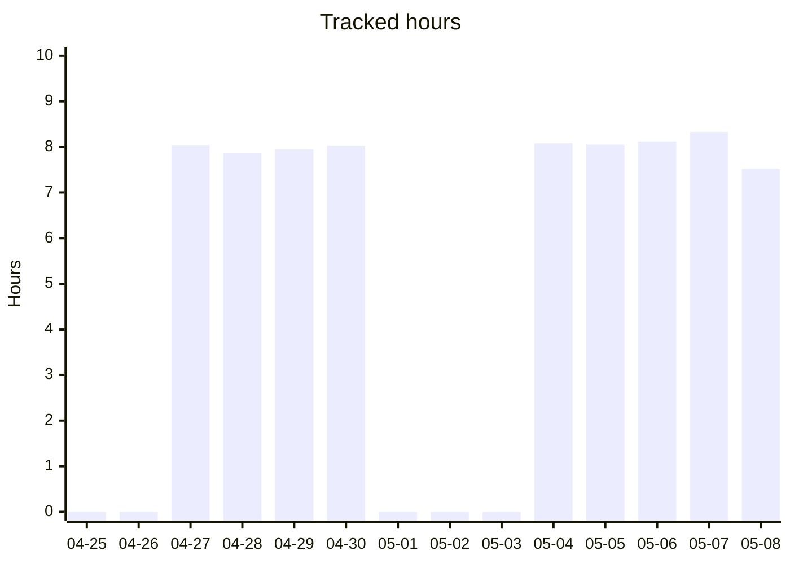

# timeclock

<!-- STATS:START -->
## Time log stats

Auto-generated from `timelog-work`.

## Work

- **Total tracked:** 420.81 h
- **Sessions:** 151
- **Active days:** 52
- **Average / active day:** 8.09 h
- **Average session:** 2.79 h

### Insights
- **Last 7 days:** 40.10 h (5.73 h/day)
- **Last 30 days:** 169.42 h (5.65 h/day)
- **Best day:** 2026-04-20 (8.83 h)
- **Most active weekday:** Wednesday (89.95 h total)
- **Longest session:** 4.91 h on 2026-04-13 (Dx Pro Designer)

### Top projects (hours)

### Last 14 days

_Generated: 2026-05-11 08:16 UTC_

<!-- STATS:END -->
