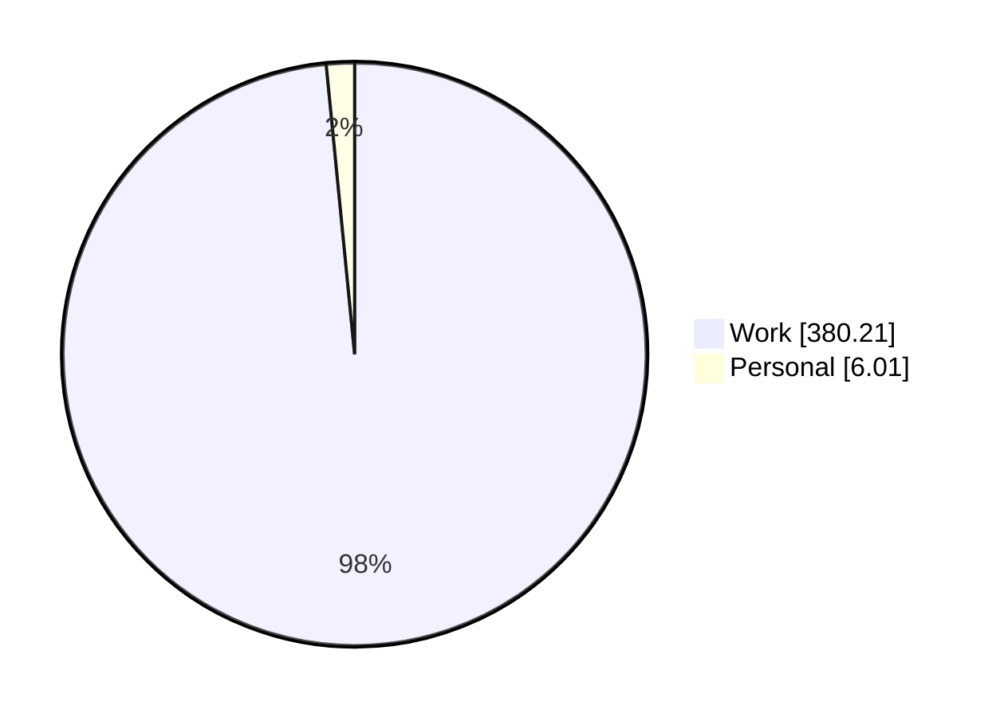
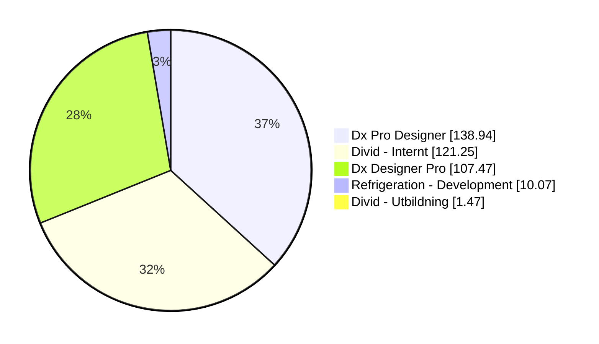
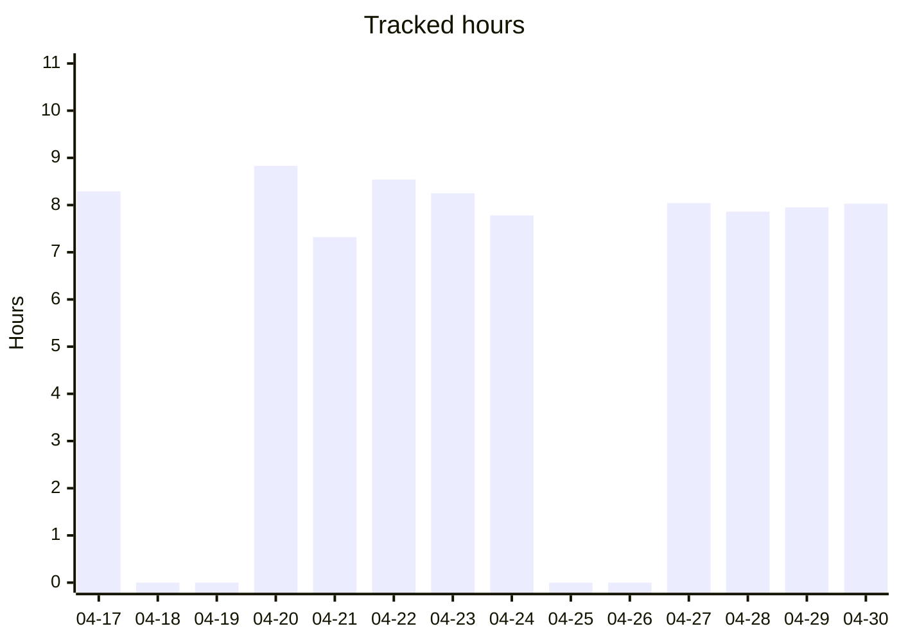
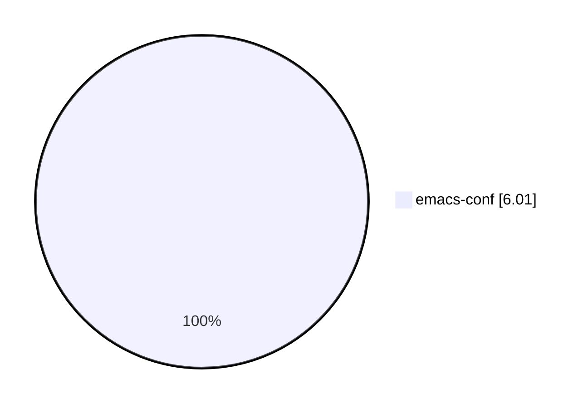
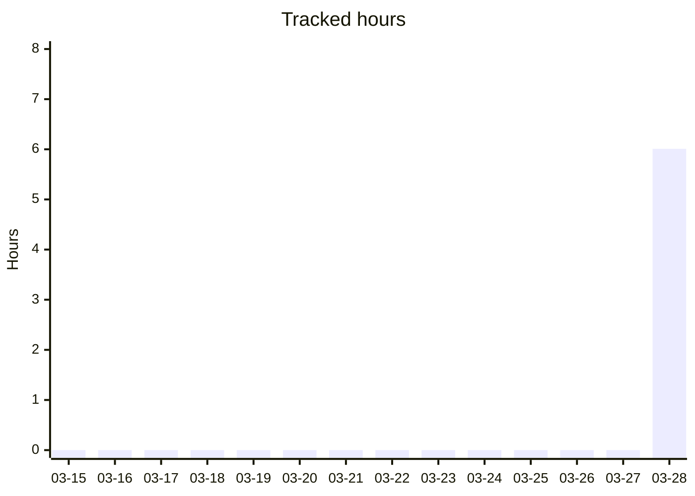

# timeclock

<!-- STATS:START -->
## Time log stats

Auto-generated from `timelog-work` and `timelog-personal`.

### Hours by scope

## Work

- **Total tracked:** 380.21 h
- **Sessions:** 129
- **Active days:** 47
- **Average / active day:** 8.09 h

### Top projects (hours)

### Last 14 days

## Personal

- **Total tracked:** 6.01 h
- **Sessions:** 1
- **Active days:** 1
- **Average / active day:** 6.01 h

### Top projects (hours)

### Last 14 days

_Generated: 2026-05-11 08:05 UTC_

<!-- STATS:END -->
